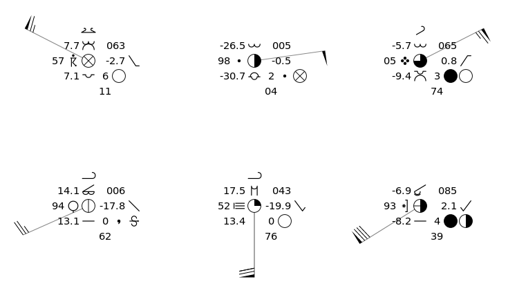
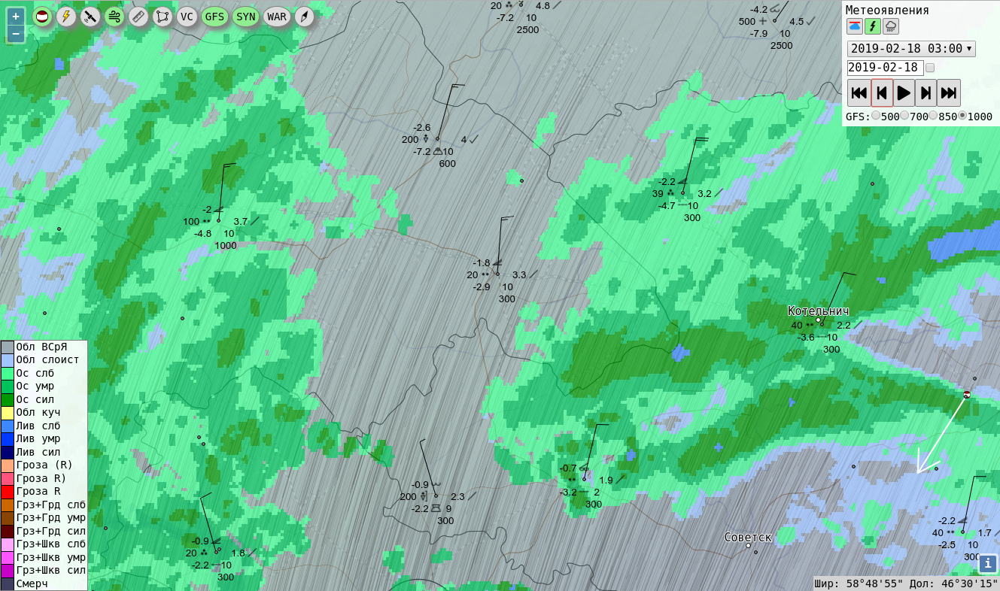

# synop\_canvas



Draw SYNOP messages on HTML canvas.

Tilemaps from https://github.com/alexander-travov/synop_tilemap

## OpenLayers integration

``` javascript
var ImageCanvasSource = ol.source.ImageCanvas
var fromLonLat = ol.proj.fromLonLat
var containsCoordinate = ol.extent.containsCoordinate

var synops = [...] // SYNOPs array

var canvas = document.createElement('canvas')

var synopSource = new ImageCanvasSource({
    canvasFunction: function draw (extent, resolution, pixelRatio, size, projection) {
        size[0] = Math.ceil(size[0])
        size[1] = Math.ceil(size[1])
        canvas.width = size[0]
        canvas.height = size[1]
    
        var minx = extent[0], miny = extent[1], maxx = extent[2], maxy = extent[3]
        var width = maxx - minx, height = maxy - miny
        var ctx = canvas.getContext('2d')
    
        for (var i = 0; i < synops.length; i++) {
            var synop = synops[i]
            var coord = fromLonLat([synop.lon, synop.lat], projection)
            if (!containsCoordinate(extent, coord)) continue
            var x = size[0] * (coord[0] - extent[0]) / (extent[2] - extent[0])
            var y = size[1] * (1 - (coord[1] - extent[1]) / (extent[3] - extent[1]))
            drawSynop(ctx, x, y, synop)
        }
        return canvas
    }
})
```


